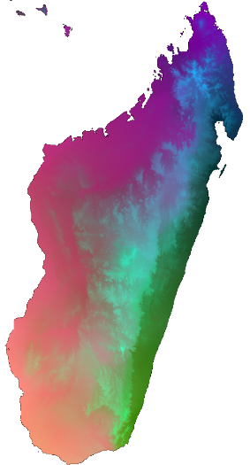

Past, present and future research in ecology and conservation biology
===
author: Ghislain Vieilledent
date: 21st June 2018
width: 1360
height: 700
css: custom.css

Outline
====================================
type: section

Past research
- Forest dynamics, tree species demography
- Forest biomass and carbon cycle
- Biogeography and climate change
- Competition and traits in tree species communities

***

Present research
- Deforestation estimates
- Deforestation and demography in Africa
- Forecasting spatial deforestation spatially
- Scenarios of oil palm expansion in Africa

Outline
====================================
type: section

Future research
- Framework
- Community models

Past research
===
type: section
- Forest dynamics, tree species demography
- Forest biomass and carbon cycle
- Biogeography and climate change
- Competition and traits in tree species communities

Forest dynamics, species demography
===
- tree growth, mortality, recruitment
- non-parametric mortality models
- individual variability within species
- temperate, tropical species
- `twoe` software: species random effect

***

Biogeography and climate change
===
- species distribution models
- climatic data
- emblematic species: gorillas, baobabs (IUCN)
- impact of climate change on species distribution
- `hSDM` software: detection, spatial autocorrelation

***

Forest biomass and carbon cycle
===
- wood density
- allometric models (biomass, H-D)
- biomass mapping (trees, soil) with remote sensing
- emmissions associated to deforestation/degradation (REDD+)
- tropical forests and climate change feedback loop

***

Competition and traits in tree species communities
===
- vertical stratification (max. height) and competition for light
- trait hierarchy (WD, SLA, max. height) and competition
- individual variability (demography, traits) and competition

***

Present research
===
type: section
- Deforestation estimates
- Deforestation and demography in Africa
- Forecasting spatial deforestation spatially
- Scenarios of oil palm expansion in Africa

Deforestation estimates
===
- Multidate semi-supervised classification of satellite images
- Forest mask $+$ tree cover loss
- `Google Earth Engine`, `R/GRASS`

***

Deforestation and demography in Africa
===
- The fate of African tropical forests
- Associated to demographic explosion
- $\text{log}D = \beta_0 + \beta_1 \text{log}F + \beta_2 \text{log}P$
- Data on deforestation: 
   * JRC: 1990-2000-2010
   * GFC: 2000-2005-2010-2015
- Projection of forest cover in 2050, 2100

***

===

Forecasting spatial deforestation spatially
===
- spatial probability of deforestation
- accessibility (dist. towns, roads, villages), landscape (dist. forest edge), land-tenure (protected areas)
- `deforestprob` Python package (including i/o with GEE)
- pantropical map of deforestation probability in 2015
- future forest cover in 2050, 2100 

***

===

Scenarios of oil palm expansion in Africa
===
- Oil palm suitability map
- Primate species vulnerability map (proxy for biodiversity)
- Areas of compromise

***

Future research
===
type: section
- Framework
- Community models

Framework
===
- Modelling and predicting the dynamics of ecological communities
- Biodiversity scenarios
   * climatic (RCP from GIEC)
   * socio-economic (SSP from GIEC), including deforestation
- At different scales
   * forest stands (community ecology)
   * pantropical (biogeography)
   * on the short or long term

***

- Variability and uncertainty of ecological processes
- Statistics: developping new approaches and tools, hierarchical Bayesian models
- Informatics: `R`, `GRASS`, `Python`, `GEE` 
- Implications on conservation strategies and policies

Community models
===
- $\beta$-biodiversity map
- explicative ecological factors of species assemblages: environment, phylogeny, traits
- Madagascar: occurrences for $>$ 5000 species
- `joint SDM`
- Impact of climate and deforestatio
- Consequences on conservation strategies

***

Thank you for attention
===
type: section
