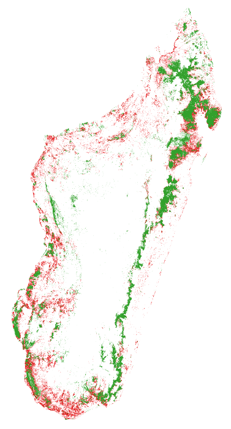

Advances regarding the modelling and forecasting of tropical deforestation
===
author: Ghislain Vieilledent
date: 28th June 2018
width: 1360
height: 700
css: custom.css

Outline
====================================
type: section

1. Deforestation and demography in Africa
2. `deforestprob` Python module
3. Spatial projections of deforestation
4. Perspectives

1. Deforestation and demography in Africa
===
- The fate of African tropical forests
- Associated to demographic explosion
- $\text{log}D = \beta_0 + \beta_1 \text{log}F + \beta_2 \text{log}P$
- Data on deforestation: 
   * JRC: 1990-2000-2010
   * GFC: 2000-2005-2010-2015
- Projection of forest cover in 2050, 2100

***

===

===

2. deforestprob Python module
===
- Spatial probability of deforestation
- $\text{logit}(\theta_i)=f(\text{spatial factors}_i)+\rho_j$
- Factors: accessibility (dist. towns, roads, villages), landscape (dist. forest edge), land-tenure (protected areas)
- $\rho_j$: spatial random effect

***

<https://github.com/ghislainv/deforestprob>

===

===

Simple GLM    

***

GLM with iCAR    

2. deforestprob Python module
===

| model | deviance | perc |
|:-------------|:-------------|:-----|
| null | 27629 | 0 |
| nsre | 25365 | 8 |
| icar | 19279 | 30 |
| full | 0 | 100 |

***

TODO: Add map of differences

3. Forecasting spatial deforestation spatially
===
- Map of deforestation probability in 2015
- Future forest cover in 2050, 2100 

***

===

3. Forecasting spatial deforestation spatially
===
- 11 countries in tropical Asia
- Including MMR, THA, KHM, LAO, VNM (ReCaREDD focus countries)
- Ex. Vietnam in 2050 (half current deforestation rate)

***

4. Perspectives
===
1. Finalize the deforestation-demography study
2. Consolidate the code for the `deforestprob` Python module and publish a methodological paper
3. Update the spatial prediction for Africa taking into account the demography
4. Extend projection to South America and publish the pantropical future forest cover map in 2050

Thank you for attention
===
type: section
