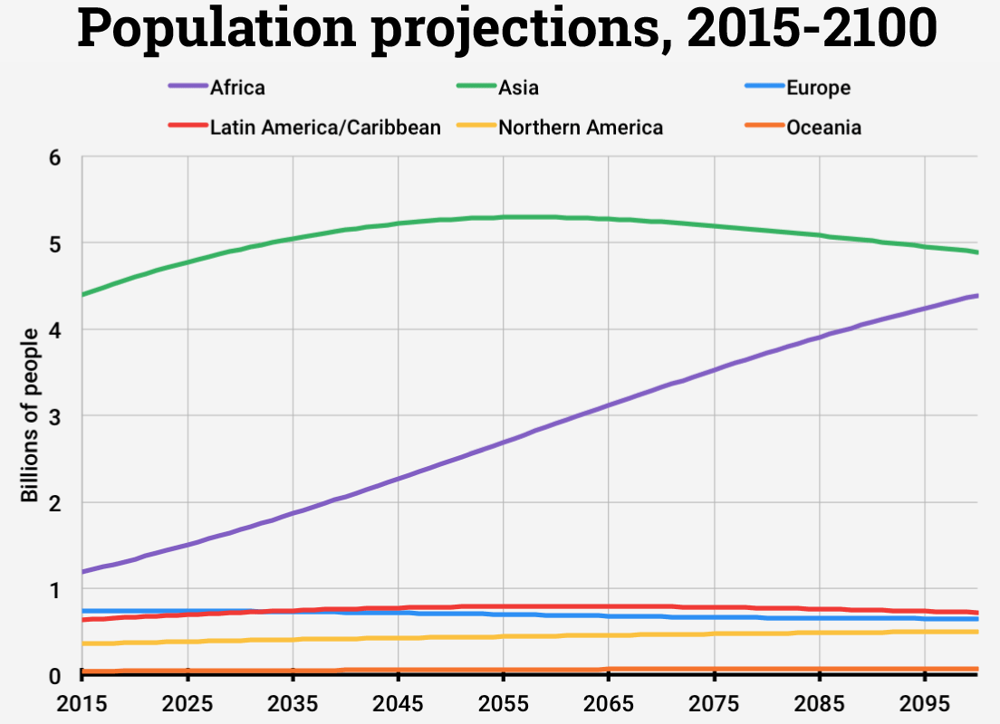

# Deforestation and demography in Africa

## Model

### Model

\bcols
\bcol{0.5\textwidth}

- The fate of African tropical forests
- Associated to demographic explosion
- $\text{log}D = \beta_0 + \beta_1 \text{log}F + \beta_2 \text{log}P$
- Data on deforestation: 
   1. JRC: 1990-2000-2010
   2. GFC: 2000-2005-2010-2015
- Projection of forest cover in 2050, 2100

\ecol
\bcol{0.5\textwidth}

\ecol
\ecols

## Results

### Model averaging per country

\centering\includegraphics[height=0.9\textheight]{figs/perc_ctry.png}

### Percentage of forest loss 21st century

\centering\includegraphics[height=0.9\textheight]{figs/Africa_map_forest_loss.png}

## Reflexion

### Reflexion

- Scientific articles
- Integration of Roadless data on deforestation?
- Use of the results for future deforestation scenario in Africa
- Predictions in percentage of forest loss: $\sim$ independent of forest definition

# `forestatrisk` Python module

## Functionality

### `forestatrisk` Python module specifications

\bcols
\bcol{0.6\textwidth}

- Spatial probability of deforestation
- $\text{logit}(\theta_i)=f(\text{spatial factors}_i)+\rho_j$
- Factors: accessibility (dist. towns, roads, villages), landscape (dist. forest edge), land-tenure (protected areas)
- $\rho_j$: spatial random effect
- {\small <https://github.com/ghislainv/forestatrisk>}

\ecol
\bcol{0.4\textwidth}

\centering\includegraphics[width=3cm]{figs/Bayes.jpg}

\centering\includegraphics[width=3cm]{figs/iCAR.png}

\ecol
\ecols

### Spatial random effects

\bcols
\bcol{0.5\textwidth}

- Hotspots of deforestation
- Not explained by the fixed env. factors

\ecol
\bcol{0.5\textwidth}
\centering\includegraphics[height=0.80\textheight]{figs/rho_orig_ggplot.png}
\ecol
\ecols

### Spatial probability of deforestation

\bcols
\bcol{0.5\textwidth}

- Computed at 30 m resolution
- \textcolor{vertmoyen}{Greener}: lower probability
- \textcolor{red}{Darker red}: higher probability

\ecol
\bcol{0.5\textwidth}
\centering\includegraphics[height=0.80\textheight]{figs/pred_binomial_iCAR.png}
\ecol
\ecols

### Future forest cover

\bcols
\bcol{0.5\textwidth}

- \textcolor{vertmoyen}{green}: residual forest in 2050
- \textcolor{red}{red}: deforested area 2010-2050

\ecol
\bcol{0.5\textwidth}
\centering\includegraphics[height=0.8\textheight]{figs/forest_cover_2050.png}
\ecol
\ecols

## Improvements

### Improvements

\bcols
\bcol{0.5\textwidth}

- Python 2.7 and Python 3.x compatible
- Spatial random effects limited to country border
- Set of new functions for model validation
- Can be used from R with `reticulate`

\ecol
\bcol{0.5\textwidth}
\centering\includegraphics[height=\textheight]{figs/forest_cover_2050.png}
\ecol
\ecols

## Model performance

### Model peformance

\bcols
\bcol{0.5\textwidth}

| model | deviance | perc |
|:-------------|:-------------|:-----|
| null | 27629 | 0 |
| nsre | 25365 | 8 |
| icar | 19279 | 30 |
| full | 0 | 100 |

\ecol
\bcol{0.5\textwidth}
TODO: Add map of differences
\ecol
\ecols

# Forecasting spatial deforestation spatially

## Extending at the tropical scale

### Africa

\bcols
\bcol{0.5\textwidth}

- Map of deforestation probability in 2015
- Future forest cover in 2050, 2100 

\ecol
\bcol{0.5\textwidth}

\ecol
\ecols

----

### Asia

\bcols
\bcol{0.5\textwidth}

- 11 countries in tropical Asia
- Including MMR, THA, KHM, LAO, VNM (ReCaREDD focus countries)
- Ex. Vietnam in 2050 (half current deforestation rate)

\ecol
\bcol{0.5\textwidth}

\ecol
\ecols

## Computational challenge

### Computational challenge

- Use of Google Cloud Computing
- Cluster of small machines with some cores
- Parrallelization: one country per machine

# Perspectives

### Perspectives

1. Finalize the deforestation-demography study
2. Consolidate the code for the `forestatrisk` Python module and publish a methodological paper
3. Update the spatial prediction for Africa taking into account the demography
4. Extend projection to South America and publish the pantropical future forest cover map in 2050
