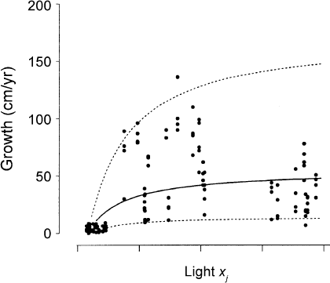
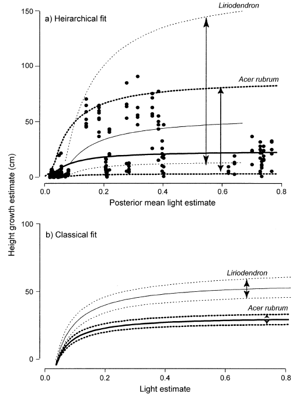
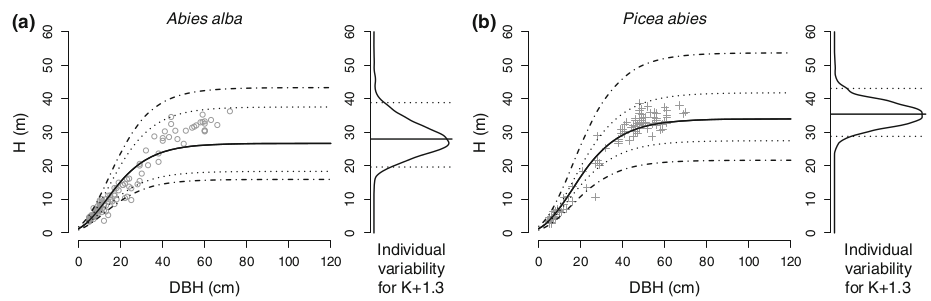

```{r options, echo=FALSE}
library(knitr)
library(kableExtra)
opts_chunk$set(echo=FALSE, cache=FALSE,
               #results="hide", 
               warning=FALSE,
               message=FALSE, highlight=TRUE,
               fig.show="hide", size="small",
               fig.align="center",
               tidy=FALSE)
options(knitr.kable.NA="-")
```

# Uncertainty and biodiversity scenarios

## Uncertainty in ecological processes

### Uncertainty in ecological processes

\bcols
\bcol{0.5\textwidth}

- Scatterplot $y_i$, $x_i$
- A statistical model $y_i=f(x_i)+\varepsilon_i$, $\varepsilon_i \sim N(0,\sigma^2)$
- A mean function $y_i=f(x_i)$
- An uncertainty $\sigma^2$

\ecol
\bcol{0.5\textwidth}

\ecol
\ecols

### Uncertainty propagation and biodiversity scenario

Propagation:

- Several ecological processes with uncertainty
- Uncertainty propagation (e.g. Monte-Carlo simulations)

Biodiversity scenario

- $\Rightarrow$ Biodiversity scenario
- With (often large) **uncertainty envelope**

\centering \includegraphics[height=0.5\textheight]{figs/scenario-uncertainty.png}

## Limitations

### Uncertainty is not stochasticity

- Uncertainty is not necessarily stochasticity
- Can be associated to **unexplained processes** that can be structured in **space** and **time**
- Unexplained processes affect the biodiversity scenario

# Intra-specific variability

## Definition

### Definition of the intra-specific variability

\bcols
\bcol{0.6\textwidth}

- All individuals within a species are not equal
- Genetic $+$ Micro-environment    (e.g. soil, climate)
- Individual response

\ecol
\bcol{0.4\textwidth}


\centering Clark et al. 2003, Ecology
\ecol
\ecols

## Examples

### Demography

\centering Competition-colonization trade-off

\centering \includegraphics[height=0.7\textheight]{figs/Clark2007-colonization-competition.png}

\centering Clark et al. 2007 _Ecology Letters_

### Allometry

\centering Height-diameter relationship



\centering Vieilledent et al. 2010 _Oecologia_

### Functional traits

\centering Specific leaf area (SLA)

\centering \includegraphics[height=0.7\textheight]{figs/Albert2011-PPEES-SLA.png}

\centering Albert et al. 2011 _PPEES_

# Impact on biodiversity scenario

## Might inverse the scenario

### Intra-specific var. might inverse the biodiversity scenario

- **RITES** = **R**andom **I**ndividual and **T**emporal **E**ffect**S**
- Individual effects = intra-specific variability
- Temporal effects = inter-annual variability (affecting all individuals of one species, e.g. climate, masting effect)

\centering \includegraphics[height=0.5\textwidth]{figs/Clark2007-RITES.png}

\centering Clark et al. 2007 _Ecology Letters_

### Structuring variability with RITES

RITES $\neq$ stochasticity, RITES $=$ structured variability

\centering \includegraphics[height=0.6\textwidth]{figs/Albert2011-PPEES-ITV.png}

\centering Albert et al. 2011 _PPEES_

## Depends on species communities

### Outputs depend on species communities

- Results depend on ratio species differences/intra-individual variability
- If ratio is big enough, no effect on output
- E.g. silver fir and Norway spruce

\centering \includegraphics[height=0.5\textwidth]{figs/Vieilledent-These-No-RITES-effects.png}

### Unstable/stable coexistence

- Species differences $+$ intra-specific variability
- All possible scenarios: **competitive exclusion** (Gause's law), **unstable coexistence** (neutral theory), **stable coexistence** (niche differenciation)

\centering \includegraphics[height=0.5\textwidth]{figs/Courbaud2012-TE_couleur.png}

\centering Courbaud et al. 2012 _Theoretical Ecology_

# Conclusion

## Summary

### Summary

- Not all uncertainties are important for biodiversity scenario and decision making (cf. B. Wintle)
- Structuring uncertainty in space and time can lead to opposite biodiversity scenarios or slow down changes in biodiversity (transient dynamics)

## Additional remark

### Additional remark

- Intra-specific variability and adaptation to change

\centering \includegraphics[height=0.5\textwidth]{figs/niche-breadth.jpg}

