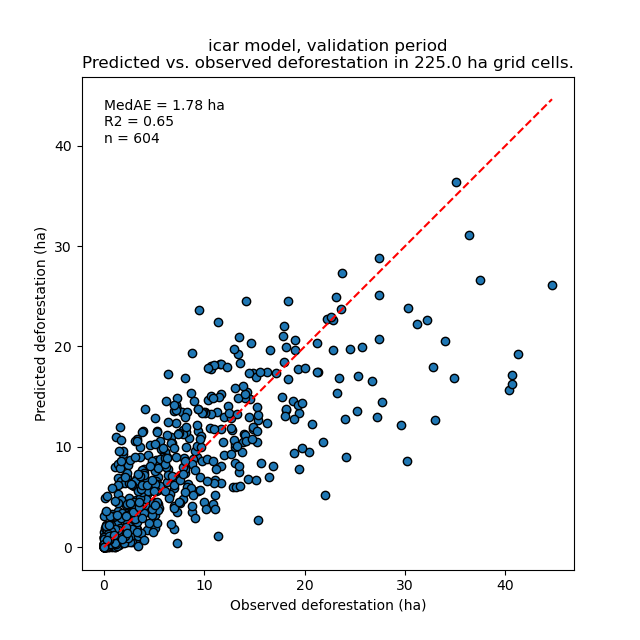

1 Introduction
--------------

1.1 Improving certification methodologies
~~~~~~~~~~~~~~~~~~~~~~~~~~~~~~~~~~~~~~~~~

1.1.1 Several criticisms to project-based approach
^^^^^^^^^^^^^^^^^^^^^^^^^^^^^^^^^^^^^^^^^^^^^^^^^^

Several criticisms were addressed to previous REDD+ methodologies for carbon credit certification accusing them to oversell credits.

- **Non-additionnality**: Emissions reductions would have happened anyway. Inflated project-level baselines. Jurisdictional reference levels are reasonably good predictors of future trends.

- **Leakage**: The larger the area covered by a REDD+ initiative, the lower the leakage risk.

- **Reversal**: Jurisdictions are less likely than projects to have their forest carbon stocks decimated by a disturbance event.

Frances Seymour (WRI): `4 Reasons Why a Jurisdictional Approach for REDD+ Crediting Is Superior to a Project-Based Approach <https://www.wri.org/insights/insider-4-reasons-why-jurisdictional-approach-redd-crediting-superior-project-based>`_.

1.1.2 New jurisdictional approach
^^^^^^^^^^^^^^^^^^^^^^^^^^^^^^^^^

1.1.2.1 Deforestation intensity :B_block:
:::::::::::::::::::::::::::::::

- Baseline activity data or Forest Reference Emission Level at the jurisdictional level

- Amount of deforestation.

- Deforestation “quantity” or “intensity”.

1.1.2.2 Spatial deforestation risk :B_block:
::::::::::::::::::::::::::::::::::

- Map of the deforestation risk at the jurisdictional level.

- Spatial relative probability of deforestation.

- Deforestation “location”.

1.2 Allocating deforestation to projects
~~~~~~~~~~~~~~~~~~~~~~~~~~~~~~~~~~~~~~~~

1.2.1 Risk map at the jurisdictional level
^^^^^^^^^^^^^^^^^^^^^^^^^^^^^^^^^^^^^^^^^^

1.2.1.1 Objectives :B_block:BMCOL:
::::::::::::::::::

- Identifying hot-spots/cold-spots of deforestation.

- Classifying forest pixels by risk of being deforested.

- One unique model for the whole jurisdiction (no methodological discrepancies between projects).

- Use this map to allocate deforestation (estimated for the jurisdiction) per project.

1.2.1.2 Figure :BMCOL:
::::::::::::::

    Map of the deforestation risk for Perou.\newline \textcolor{darkgreen}{Green}: low, \textcolor{red}{Red}/\textbf{Black}: high.

1.2.2 Allocating deforestation to projects
^^^^^^^^^^^^^^^^^^^^^^^^^^^^^^^^^^^^^^^^^^

- Jurisdictional risk map: a map with class of deforestation risk.

- Obtaining a deforestation density map:\newline Class of defor. risk [1, 2, ..., :math:`I`] :math:`\rightarrow` Defor. density (ha/yr/pixel).

- Can be used to allocate deforestation per project.

.. figure:: figs/get_started/allocation.png

    Allocating deforestation to projects within the jurisdiction.

2 Verra methodology for risk mapping
------------------------------------

2.1 VT0007 tool
~~~~~~~~~~~~~~~

2.1.1 VT0007 tool
^^^^^^^^^^^^^^^^^

- Developed by Clark University (J. R. Eastman and R. G. Pontius Jr.) for Verra.

- **Aim**: Obtaining the best risk map possible at the jurisdictional level.

2.1.1.1 Basic steps :B_block:
:::::::::::::::::::

1. Use a reasonably good reference model to map the deforestation risk.

2. Let the user propose alternative maps from alternative models.

3. Validation step: check that alternative models are better than the benchmark model.

4. Use the best alternative map to allocate deforestation.

2.1.2 Modelling periods
^^^^^^^^^^^^^^^^^^^^^^^

- Three dates: t1, t2, t3.

- Four periods: calibration, validation, historical, (baseline validity period).

- Why different periods: model predictions must be compared with **independent data** (validation period).

- To forecast after t3, we want to use as much data as possible (historical period).

2.2 Benchmark model
~~~~~~~~~~~~~~~~~~~

2.2.1 Benchmark model
^^^^^^^^^^^^^^^^^^^^^

- Benchmark model or reference model.

- A reasonably good deforestation model (better than a null model).

- Assuming a *decrease of deforestation with distance to forest edge* (commonly admitted).

- And a *different model between subjurisdictions* (regional variability).

    Subjurisdictions in Martinique (MTQ)

2.2.2 Distance threshold
^^^^^^^^^^^^^^^^^^^^^^^^

- Identify the distance to forest edge below which **99.5%** of the deforestation occur.

- Use this distance to define the first class of risk (class 1).

.. image:: figs/get_started/perc_dist.png

2.2.3 From distance to risk class
^^^^^^^^^^^^^^^^^^^^^^^^^^^^^^^^^

- Distances below the threshold are transformed into classes of deforestation risk.

- A geometric series is used for that, ensuring that classes have a wider range for bigger distances.

- We define 29 additional classes of risk from 2 to 30 (class 1 has already been defined).

2.2.4 Classes from subjurisdictions
^^^^^^^^^^^^^^^^^^^^^^^^^^^^^^^^^^^

- Each subjurisdiction get a number from 1 to (potentially) 999.

- We combine classes derived from distance with subjurisdictions in the following way: :math:`\textbf{DD}\text{SSS}`, with **DD** the distance class and SSS the subjurisdiction number.

- We obtain classes going from 01001 to potentially 30999 if there are 999 subjurisdictions.

- So for 10 subjurisdictions, we obtain ~300 classes (but some distance classes might be missing).

2.2.5 Classes from subjurisdictions
^^^^^^^^^^^^^^^^^^^^^^^^^^^^^^^^^^^

- Following these steps, we obtain a map at the jurisdictional level where each forest pixel belongs to a given class of deforestation risk.

- Area in dark green: classes :math:`\mathbf{1}\text{SSS}`, beyond the deforestation threshold.

2.2.6 Deforestation density
^^^^^^^^^^^^^^^^^^^^^^^^^^^

- Each class :math:`i` has an associated **deforestation probability**: :math:`\theta_{m,i} = d_{i} / n_{i}` (unitless), with :math:`d_{i}` the number of deforested pixels during the period, and :math:`n_{i}` the number of forest pixels at the beginning of the period.

- **Quantity adjustment :math:`\rho`**: :math:`\theta_{a,i} = \rho \theta_{m,i}`, so that total predicted deforestation = observed (or expected) deforestation. For the benchmark model for the calibration and historical periods, :math:`\rho=1`.

- **Deforestation density (in ha/yr per pixel)** computed as :math:`\delta_{i} = \theta_{a,i} \times A / T`. :math:`A`: pixel area (in ha), :math:`T`: time-interval of the period (in yr).

- The deforestation density is used to predict the amount of deforestation for each pixel belonging to a given class of deforestation risk.

2.2.7 Deforestation density
^^^^^^^^^^^^^^^^^^^^^^^^^^^

.. table:: Deforestation rates for each class of deforestation risk (numbers truncated to three decimal digits).
    :name: tab-defrate

    +------+-------------+-------------+----------------------+----------------------+-----------+-----------+--------------------+
    |  cat | :math:`n_i` | :math:`d_i` | :math:`\theta_{m,i}` | :math:`\theta_{a,i}` | :math:`T` | :math:`A` | :math:`\delta_{i}` |
    +======+=============+=============+======================+======================+===========+===========+====================+
    | 1001 |       33433 |           0 |                  0.0 |                  0.0 |        10 |      0.09 |                0.0 |
    +------+-------------+-------------+----------------------+----------------------+-----------+-----------+--------------------+
    | 1002 |       12965 |           0 |                  0.0 |                  0.0 |        10 |      0.09 |                0.0 |
    +------+-------------+-------------+----------------------+----------------------+-----------+-----------+--------------------+
    | 1003 |       91686 |          19 |            2.072e-04 |            2.072e-04 |        10 |      0.09 |          1.865e-06 |
    +------+-------------+-------------+----------------------+----------------------+-----------+-----------+--------------------+
    | 1004 |       82279 |           5 |            6.076e-05 |            6.076e-05 |        10 |      0.09 |          5.469e-07 |
    +------+-------------+-------------+----------------------+----------------------+-----------+-----------+--------------------+
    | 2001 |        1373 |           0 |                  0.0 |                  0.0 |        10 |      0.09 |                0.0 |
    +------+-------------+-------------+----------------------+----------------------+-----------+-----------+--------------------+

**Deforestation density (in ha/yr per pixel)** computed as :math:`\delta_{i} = \theta_{a,i} \times A / T`

2.2.8 Deforestation density
^^^^^^^^^^^^^^^^^^^^^^^^^^^

Deforestation density can be used to allocate deforestation to projects within a jurisdiction.

.. figure:: figs/get_started/allocation.png

    Allocating deforestation to projects within the jurisdiction.

2.3 Alternative models and validation
~~~~~~~~~~~~~~~~~~~~~~~~~~~~~~~~~~~~~

2.3.1 Alternative models
^^^^^^^^^^^^^^^^^^^^^^^^

- Alternative maps from alternative models must be compared with the benchmark model.

- The alternative model can be of different forms: geoprocessing model (moving window), statistical model (iCAR, GLM, RF).

- E.g. Clark Labs propose the MLP (Multi-Layer Perceptron) statistical model in the Land Change Modeller module of the `TerrSet <https://clarklabs.org/terrset/>`_ software.

2.3.2 Alternative models
^^^^^^^^^^^^^^^^^^^^^^^^

- A risk map with deforestation densities derived from the alternative model must be provided.

    Risk map obtained with a moving window model.

2.3.3 Validation procedure
^^^^^^^^^^^^^^^^^^^^^^^^^^

- Comparing predicted vs. observed deforestation (in ha) in a coarse grid.

- For a given period of time.

    Coarse grid covering the area of interest.

2.3.4 Validation procedure
^^^^^^^^^^^^^^^^^^^^^^^^^^

- Comparing predicted vs. observed deforestation.

- Performance indices: :math:`R^2`, and median of absolute error (MedAE).

2.3.5 Validation procedure
^^^^^^^^^^^^^^^^^^^^^^^^^^

- Performance indices are computed for each model.

- The model with the higher :math:`R^2` and the lower MedAE is selected.

.. table:: Performance indices.
    :name: tab-indices

    +-------+------------+--------+-------+------+------+-------+
    | ncell | period     | model  | MedAE |   R2 | RMSE | wRMSE |
    +=======+============+========+=======+======+======+=======+
    |   604 | validation | bm     |  2.71 | 0.43 | 6.08 |  6.22 |
    +-------+------------+--------+-------+------+------+-------+
    |   604 | validation | icar   |  1.78 | 0.65 | 4.79 |  4.59 |
    +-------+------------+--------+-------+------+------+-------+
    |   604 | validation | glm    |  2.39 | 0.38 | 6.39 |  6.52 |
    +-------+------------+--------+-------+------+------+-------+
    |   604 | validation | rf     |  2.09 | 0.50 | 5.69 |  5.74 |
    +-------+------------+--------+-------+------+------+-------+
    |   604 | validation | mw\_11 |  2.34 | 0.56 | 7.66 |  6.83 |
    +-------+------------+--------+-------+------+------+-------+
    |   604 | validation | mw\_21 |  2.51 | 0.56 | 7.54 |  6.66 |
    +-------+------------+--------+-------+------+------+-------+

2.3.6 Validation procedure
^^^^^^^^^^^^^^^^^^^^^^^^^^

.. _tab-periods:

- We can compare predicted vs. observed deforestation for three time periods: **calibration**, **validation**, and **historical period**.

- To estimate model performance at forecasting deforestation in the future: **predicted vs. observed deforestation** for the **validation period** with a model fitted over the **calibration period**.

- This way, we use **independent observations** of deforestation for model validation (observed deforestation over the validation period have not be used to calibrate the model).

- Verra’s methodology: the alternative model must be better for both the calibration and validation periods.

3 Software for deforestation risk mapping
-----------------------------------------

3.1 Verra/Clark Labs software
~~~~~~~~~~~~~~~~~~~~~~~~~~~~~

3.1.1 Verra/Clark Labs software
^^^^^^^^^^^^^^^^^^^^^^^^^^^^^^^

\centering Standalone app: `https://github.com/ClarkCGA/UDef-ARP <https://github.com/ClarkCGA/UDef-ARP>`_ 
\centering QGIS plugin: `https://github.com/ClarkCGA/UDef-ARP-Plugin <https://github.com/ClarkCGA/UDef-ARP-Plugin>`_

3.1.2 Verra/Clark Labs software
^^^^^^^^^^^^^^^^^^^^^^^^^^^^^^^

- User must provide rasters: forest cover change, distance to forest edge at several dates, subjurisdictional borders, alternative risk maps at several dates.

- Using this data, the UDef-ARP provides the basis:

  - for developing a benchmark model.

  - for comparing the benchmark and alternative models.

3.1.3 Limitations
^^^^^^^^^^^^^^^^^

- No tool to help prepare the data.

- No tool to help develop the **alternative models**.

- Windows only (at the moment).

- Require a computer with high RAM for large jurisdiction: all rasters are stored in RAM during processing. Therefore, large jurisdictions will **require substantial RAM allocations** (e.g., 64Gb).

- Use of Float data for risk maps with deforestation density (ha/pixel/yr): **large space on disk**.

- Documentation in English only, **no translations available**.

- Recent tool, some feedbacks from users (e.g. Fronterra): `Post 1 <https://www.linkedin.com/posts/fron-terra_forest-carbon-climatechange-activity-7179166090042732544-YnAK?utm_source=share&utm_medium=member_desktop>`_, `Post 2 <https://www.linkedin.com/posts/fron-terra_forest-carbon-climatechange-activity-7179721587267371008-PRXr?utm_source=share&utm_medium=member_desktop>`_, `Post 3 <https://www.linkedin.com/posts/fron-terra_carbon-climatechange-verra-activity-7180971577746862080-rolc?utm_source=share&utm_medium=member_desktop>`_.

3.2 Existing software for alternative models
~~~~~~~~~~~~~~~~~~~~~~~~~~~~~~~~~~~~~~~~~~~~

3.2.1 Existing software for alternative models
^^^^^^^^^^^^^^^^^^^^^^^^^^^^^^^^^^^^^^^^^^^^^^

- `Dinamica EGO <https://csr.ufmg.br/dinamica/>`_: Universidade Federal de Minas Gerais, Brazil.

- `Land Change Modeler <https://clarklabs.org/terrset/land-change-modeler/>`_: Clark Labs, Clark University, Worcester, USA.

- `CLUE <https://www.environmentalgeography.nl/site/data-models/data/clue-model/>`_: Institute for Environmental Studies, Vrije Universiteit, Amsterdam, Netherlands .

**Great programs** with many applications. Many scientific studies, published in a large number of scientific articles, have used these programs.

3.3 Limitations
~~~~~~~~~~~~~~~

3.3.1 Limitations
^^^^^^^^^^^^^^^^^

- Not all are open source (e.g. Dinamica EGO and LCM): **transparency**.

- Not all are free (e.g. LCM): but discount for student and developing countries.

- Not all allow scripting (e.g. LCM, CLUE): **reproducibility**.

- Might not work with high resolution (<= 30 m) rasters on large jurisdictions (country scale).

- Limited number of statistical models for modelling land use change: limited accuracy and over-fitting.

See **Vieilledent et al.** 2021, *JOSS*, doi: `10.21105/joss.02975 <https://doi.org/10.21105/joss.02975>`_ for more details.

3.3.2 Limitations
^^^^^^^^^^^^^^^^^

- Verra’s methodology includes **several steps** (calibration, validation, forecast), which must be **repeated** (model, period).

- It must be possible to follow Verra’s methodology with one of these programs (given some requirements, such as high RAM computer).

- But it would require a lot of work for the user to adapt the use of the program to Verra’s methodology (e.g. validation step with coarse grid).

- **Note**: in the documentation for UDef-ARP, Clark Labs indicates plans to offer a utility to facilitate the creation of vulnerability maps for alternative models in the near future.

4 Conclusion
------------

4.1 A not so simple methodology
~~~~~~~~~~~~~~~~~~~~~~~~~~~~~~~

4.1.1 Summary
^^^^^^^^^^^^^

- We need a **map of the deforestation risk** at the **jurisdictional level**.

- Deforestation risk: **deforestation density** in ha/pixel/yr.

- This map should be better than the map derived from the benchmark model.

- The best map will be used to **allocate deforestation** to projects within the jurisdiction.

4.1.2 A not so simple methodology
^^^^^^^^^^^^^^^^^^^^^^^^^^^^^^^^^

- Risk map must be obtained following Verra/Clark Labs methodology.

- The methodology was developed with simplicity in mind.

- But modelling deforestation is inherently complicated and model comparison and validation require a minimal number of steps.

- This makes hard to develop an alternative model better than the benchmark model using existing tools.

4.2 Need for an integrative tool: deforisk QGIS plugin
~~~~~~~~~~~~~~~~~~~~~~~~~~~~~~~~~~~~~~~~~~~~~~~~~~~~~~

4.2.1 Need for an integrative tool: the deforisk QGIS plugin
^^^^^^^^^^^^^^^^^^^^^^^^^^^^^^^^^^^^^^^^^^^^^^^^^^^^^^^^^^^^

- A utility to facilitate the creation of risk maps for alternative models is needed.

- Specificities:

  - **Integrative**: all the steps of Verra’s methodology (benchmark model, alternative models, validation, allocation).

  - **Accuracy**: high accuracy for forecasting deforestation.

  - **Easy to use**: simple interface with documentation.

  - **Transparent and reproducible**: using open-source software (important for carbon/biodiversity credit certification).

4.2.1.1 Text :BMCOL:
::::::::::::

- Cirad and FAO have worked at developing the ``deforisk`` QGIS plugin to meet these objectives: `https://ecology.ghislainv.fr/deforisk-qgis-plugin <https://ecology.ghislainv.fr/deforisk-qgis-plugin>`_

4.2.1.2 Image :BMCOL:
:::::::::::::

